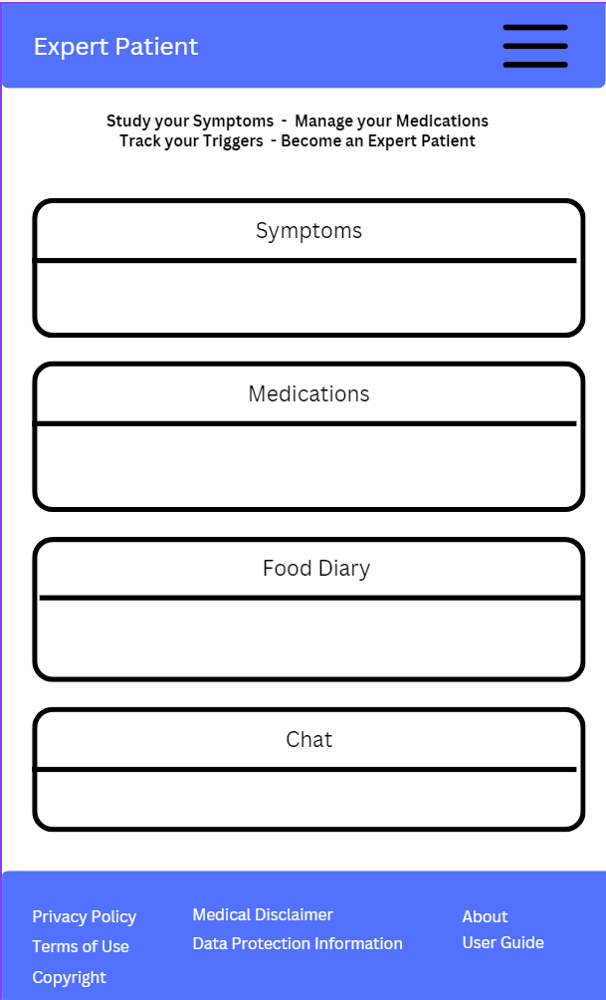

# UC Expert - Ulcerative Colitis Patient Management System

UC Expert is a comprehensive Django-based web application designed to help patients with Ulcerative Colitis (UC) manage their condition effectively. It provides tools for tracking symptoms, medications, food triggers, and offers AI-powered chat support for UC-related questions which are answered solely within the context of provided information.


## Pre-Development

<details>
<summary>The Idea</summary>
<br>
I settled on a challenging goal: create a comprehensive Ulcerative Colitis management tool incorporating advanced AI chat capabilities through a RAG (Retrieval Augmented Generation) system. While RAG might seem "overkill" for the initial scope, it was chosen for:

- Learning opportunity in AI integration
- Future scalability for multiple medical conditions
- Potential for modular reuse
- Enhanced user support capabilities
- Control over LLM responses
<br>
<br>
</details>

<details>
<summary>Why UC Expert?</summary>
<br>
After having conversation with the medical director of InVita intellignece, Mark Sullivan, I noticed a misalignment between doctors and their patients on a particular idea. Mark explained to me how doctors value "Expert Patients". Having a patient who understands their condition well is beneficial to the doctor, as what is reported to them tends to be more accurate and relevant. I did some research among family, friends and peers, and learned that this notion is not realised by many people suffering from some form of affliction that is regularly monitored by their doctor. They feel as though, if anything, they are pushed away from understsnding the exact workings of their condition, and are simply told what to monitor and how to do it. This can work fine for many dilligent patients, but some stated thay feel a disconnect. They want to understand their illness in depth, but may feel "stupid" when speaking to a doctor regarding recent developments in symptoms or things they may think are of note. UC expert was born of my own experience in this area and response I received from others. It aims to create expert UC patients by allowing them to interact with an AI, regarding not just general information on the disease, but specific information relating to their current symptoms and state of their condition. They can ask the "stupid" questions they may prefer not to ask their doctor, gain re-assurance on particular issues, gain a deeper understanding of what may be causing them and have a record of symptoms they can then talk more confidently with their doctor about. The AI must re-direct to a mecical professional when the users interaction warrants it.
<br>
<br>
</details>


<details>
<summary>The Prototype Introduction</summary>
<br>
 Before I started the real project I decided to build a prototype using AI. This is a methodology I have adopted that allows me to ideate, validate, and test in a rapid and cutting edge manner. The new capabilities of LLM's and IDE's with native LLM integration allow for a this novel approach, which provides many advantages. I do initial research on the technologies required to build the app I have in mind, as you would expect. However, I then use this research to develop a comprehensive pseudocode style plan that will prompt an IDE native LLM to build the app. Once the prototype is complete I can quickly alter elements, iterate on possible features or improve existing ones, all while testing it's capabilities to see if it is performing as I expect. This allows me to interact with any product idea I have very quickly. It leads to rapid itterations and more detailed plans including refactoring before I have even written a line of code. I can then use the prototype as a basis to develop the app with minimal AI assitance, as I did with this project. It is a great way to learn a new technology. You gain an understanding of it's architecture and core pinciples without worrying about having to learn the detailed syntax of a particular function, that upon later testing turns out to be reduntant or unused by the user. 
<br>
<br>
</details>


<details>
<summary>The Research Phase</summary>
<br>

- Studied RAG system implementations by watching videos and reading langchain documentation.
- Explored Django best practices and watched tutorials on django architecture and implementation.
- Investigated AI integration options (Local/API and Model choice).
<br>
<br>
</details>


<details>
<summary>AI-Assisted Learning</summary>
<br>

- Used Claude AI for development planning.
- Leveraged Cursor.directory for Django best practice prompts.
- Created comprehensive prompts covering:

    - Django architecture
    - LangChain integration
    - RAG system implementation
    - Tailwind CSS styling
    - Database ERD
<br>
<br>
</details>


<details>
<summary>AI development</summary>
<br>
Used AI native Cursor IDE to develop the prototype. The main body of this took around an hour. I then developed it further by adding features and refinements until I was happy with it as a proof of concept. 

It can be found here https://github.com/GuyMitchy/Expert-Patient
<br>
<br>
</details>

<details>
<summary>Technical Validation</summary>
<br>

- Tested RAG using Ollama locally
- Verified basic Django structure
- Validated database relationships
- Assessed UX/UI concepts
<br>
<br>
</details>


<details>
<summary>The Outcomes</summary>
<br>

- Gained a deeper understanding of django project architecture
- Vaildated proof of concept and viabilty as a potential capstone project candidate.
- Prototype acts as a roadmap and development guide
- Learning opportunity - Native AI with indexed codebase allows me to question "how and why" things are working as they do. Learning as the AI explains syntax and implementation details. 
- LLM monitoring and assesment - Gained a deeper understanding on the capabilty of LLM's. Upon asking for explanations you realise the mistakes it makes (usually overcomplicating things), learning from it's mistakes like I would learn from my own.
- Deeper understanding of the importance of comprehensive planning, realisation that "It's all in the planning"

Once the prototype was complete and my assemment on viabilty was made I chose to proceed with the project.
<br>
<br>
</details>


## Development Plan

### Strategy

<details>
<summary>Primary goals</summary>

<br>

- Help UC patients track and manage their condition effectively by tracking symptoms, medications and Foods.
- Allow users to interact with a chatbot regarding their condition in order to become an expert patient.
- Focus on creating a reliable, easy-to-use health management tool.
- Enable data-driven conversations with healthcare providers by having a record of their condition.
<br>
<br>
</details>

<details>
<summary>User Needs</summary>
<br>

- Record and track my symptoms
- Manage my medication regimen
- Get reliable information about my condition
- Track my food intake and understand how it affects my condition
- Have secure access to my medical information
- Have the AI understand my specific condition
- Trust the AI's information
- Have the AI to maintain conversation context
<br>
<br>
</details>

<details>
<summary>Project requirements</summary>
<br>
The project requirements were taken from the assesment criteria located here (https://docs.google.com/document/d/1hqYa0lJszFtzzyRbjH-BKj2ng5XkNX7oukh9kXo-UM4/edit?tab=t.0)
<br>
<br>
</details>

<details>
<summary>User Stories</summary>

#### GitHub User Story Populator Utility
To efficiently manage the user story development process, I created a utility to automatically generate GitHub issues from user stories in .yaml format (https://github.com/GuyMitchy/github-user-story-populator).

This automated approach allowed for:

- Consistent issue formatting
- Automatic label application (Must Have, Should Have, etc.)
- Creation of task checkboxes for acceptance criteria
- Improved development workflow

#### User Stories
<details>
<summary> user_stories.yaml</summary>

```yaml
stories:
  - type: Feature
    title: "Symptom Logging System"
    as_a: "UC patient"
    i_want: "to record and track my symptoms"
    so_that: "I can monitor my condition's progression and share accurate information with my healthcare providers"
    priority: "Must Have"
    labels: ["Must Have", "User"]
    acceptance_criteria:
      - "Can select from predefined symptom types (pain, blood, urgency, fatigue, joint pain, diarrhoea, other)"
      - "Can rate severity on a 1-5 scale"
      - "Can add descriptive notes about symptoms"
      - "Can set the date of symptoms"
      - "Can view a list of recorded symptoms"
      - "Can edit or delete existing symptom entries"

  - type: Feature
    title: "Medication Management System"
    as_a: "UC patient"
    i_want: "to manage my medication regimen"
    so_that: "I can maintain consistent treatment and track the effectiveness of different medications"
    priority: "Must Have"
    labels: ["Must Have", "User"]
    acceptance_criteria:
      - "Can add new medications with name, dosage, and frequency"
      - "Can specify medication start date"
      - "Can mark medications as active/inactive"
      - "Can add notes about medications"
      - "Can view complete medication history"
      - "Can edit medication details"
      - "Can delete medication entries"

  - type: Feature
    title: "Basic AI Chat Support"
    as_a: "UC patient"
    i_want: "to get reliable information about my condition"
    so_that: "I can make informed decisions about my daily health management"
    priority: "Must Have"
    labels: ["Must Have", "User"]
    acceptance_criteria:
      - "Can start new conversations with custom titles"
      - "Can receive responses based on verified UC information"
      - "Can view chat history"
      - "Receives emergency guidance for severe symptoms"
      - "Gets redirected to healthcare providers when appropriate"
      - "Can access previous conversations"

  - type: Feature
    title: "Personalized AI Responses"
    as_a: "UC patient"
    i_want: "the AI to understand my specific condition"
    so_that: "I can receive relevant and personalized guidance for my unique situation"
    priority: "Must Have"
    labels: ["Must Have", "User"]
    acceptance_criteria:
      - "AI references user's current medications in responses"
      - "AI considers user's symptom history when giving advice"
      - "AI provides personalized recommendations based on user data"
      - "AI maintains medical context throughout conversation"
      - "AI flags concerning symptom patterns"
      - "AI avoids contradicting user's current treatment plan"

  - type: Feature
    title: "Food Diary Management"
    as_a: "UC patient"
    i_want: "to track my food intake and its effects"
    so_that: "I can identify trigger foods and maintain a diet that minimizes flare-ups"
    priority: "Must Have"
    labels: ["Must Have", "User"]
    acceptance_criteria:
      - "Can log meals with date and time"
      - "Can specify food items consumed"
      - "Can mark foods as 'safe' or 'trigger'"
      - "Can note specific reactions to foods"
      - "Can view food diary history"
      - "Can identify trigger foods through history"
      - "Can edit or delete food diary entries"

  - type: Feature
    title: "User Authentication System"
    as_a: "UC patient"
    i_want: "secure access to my medical information"
    so_that: "I can maintain privacy and confidentiality of my health data"
    priority: "Must Have"
    labels: ["Must Have", "User"]
    acceptance_criteria:
      - "Can register for an account"
      - "Can log in securely"
      - "Can log out"
      - "Can only access own medical data"
      - "Has persistent data across sessions"

  - type: Feature
    title: "Conversation Management"
    as_a: "UC patient"
    i_want: "to organize and review my AI conversations"
    so_that: "I can easily reference previous advice and track my health-related questions over time"
    priority: "Should Have"
    labels: ["Should Have", "User"]
    acceptance_criteria:
      - "Can create titled conversations"
      - "Can view list of all conversations"
      - "Can navigate between different conversations"
      - "Can see timestamp for each message"
      - "Can identify bot vs user messages"

  - type: Feature
    title: "AI Knowledge Verification"
    as_a: "UC patient"
    i_want: "to trust the AI's information"
    so_that: "I can confidently use its guidance in managing my condition"
    priority: "Should Have"
    labels: ["Should Have", "User"]
    acceptance_criteria:
      - "AI clearly indicates when information is not available"
      - "AI provides consistent answers to similar questions"
      - "AI acknowledges medical disclaimer when appropriate"
      - "AI maintains professional medical terminology"
      - "AI correctly categorizes symptom severity"

  - type: Feature
    title: "AI Chat Context Management"
    as_a: "UC patient"
    i_want: "the AI to maintain conversation context"
    so_that: "I can have more meaningful and coherent discussions about my health concerns"
    priority: "Could Have"
    labels: ["Could Have", "User"]
    acceptance_criteria:
      - "AI remembers previous questions in conversation"
      - "AI can reference earlier parts of conversation"
      - "AI maintains consistent advice throughout chat"
      - "AI can clarify previous responses"
      - "AI can update responses based on new information"

  - type: Feature
    title: "Out of Scope Features"
    as_a: "Developer"
    i_want: "to document features that won't be implemented"
    so_that: "we can maintain clear project boundaries"
    priority: "Wont Have"
    labels: ["Wont Have", "Developer"]
    acceptance_criteria:
      - "Medication reminders/scheduling"
      - "Direct healthcare provider communication"
      - "File upload for medical documents"
      - "Medication interaction checking"
      - "Integration with medical devices/apps"
      - "Real-time symptom alerts"
      - "Automated meal planning"
      - "Social features or community support"
      - "Integration with electronic health records"


     
  # LO1: Agile Planning and Design
  - type: Feature
    title: "Front-End Design Implementation"
    as_a: "Developer"
    i_want: "to implement accessible and responsive front-end design"
    so_that: "the application meets WCAG guidelines and provides a consistent user experience"
    priority: "Must Have"
    labels: ["Must Have", "Developer"]
    acceptance_criteria:
      - "Implement semantic HTML5 elements throughout (header, nav, main, footer, etc.)"
      - "Pass WCAG validation with no errors"
      - "Implement responsive design using CSS Grid/Flexbox/Media Queries"
      - "Ensure consistent styling across all pages"
      - "Verify functionality across different screen sizes (mobile, tablet, desktop)"
      - "Implement clear navigation structure"
      - "Use Bootstrap or custom CSS framework consistently"

  - type: Feature
    title: "Database Structure Implementation"
    as_a: "Developer"
    i_want: "to implement a Django database-backed application"
    so_that: "data can be efficiently managed and stored"
    priority: "Must Have"
    labels: ["Must Have", "Developer"]
    acceptance_criteria:
      - "Configure Django application with PostgreSQL database"
      - "Create at least one custom model meeting project requirements"
      - "Implement proper field types and relationships"
      - "Configure model constraints and validation"
      - "Implement efficient database queries using Django's ORM"
      - "Document model relationships in README"

  - type: Feature
    title: "Agile Project Management Implementation"
    as_a: "Developer"
    i_want: "to maintain an active Agile project management system"
    so_that: "project progress is tracked and documented"
    priority: "Must Have"
    labels: ["Must Have", "Developer"]
    acceptance_criteria:
      - "Set up project board (GitHub Projects or similar)"
      - "Create and maintain user stories with clear acceptance criteria"
      - "Link all stories to project goals"
      - "Update board regularly showing sprint progress"
      - "Document Agile process in README"
      - "Include screenshots of board progression"

  - type: Feature
    title: "Code Quality Standards"
    as_a: "Developer"
    i_want: "to implement high-quality Python code"
    so_that: "the application is maintainable and reliable"
    priority: "Must Have"
    labels: ["Must Have", "Developer"]
    acceptance_criteria:
      - "Implement custom Python logic with compound statements"
      - "Follow PEP 8 style guidelines"
      - "Use consistent naming conventions (snake_case for Python)"
      - "Include comprehensive docstrings for all functions/classes"
      - "Add explanatory comments for complex logic"
      - "Maintain consistent indentation"
      - "Use descriptive variable and function names"

  - type: Feature
    title: "UX Design Documentation"
    as_a: "Developer"
    i_want: "to document the UX design process"
    so_that: "design decisions are clearly understood"
    priority: "Must Have"
    labels: ["Must Have", "Developer"]
    acceptance_criteria:
      - "Create wireframes for all pages (mobile and desktop)"
      - "Develop visual mockups showing color schemes"
      - "Document user stories and acceptance criteria"
      - "Include design process reasoning in README"
      - "Document all major design changes and rationale"
      - "Include sitemap or information architecture diagram"

  # LO2: Data Model and Business Logic
  - type: Feature
    title: "Database Development"
    as_a: "Developer"
    i_want: "to implement a consistent database structure"
    so_that: "data integrity is maintained"
    priority: "Must Have"
    labels: ["Must Have", "Developer"]
    acceptance_criteria:
      - "Design normalized database schema"
      - "Document table relationships with ERD"
      - "Implement appropriate data types and constraints"
      - "Create and maintain database migrations"
      - "Document database schema in README"
      - "Implement proper indexes for performance"

  - type: Feature
    title: "Enhanced CRUD Implementation"
    as_a: "Developer"
    i_want: "to implement comprehensive CRUD functionality"
    so_that: "users can effectively manage data"
    priority: "Must Have"
    labels: ["Must Have", "Developer"]
    acceptance_criteria:
      - "Implement Create operations with validation"
      - "Implement Read operations with filtering/search"
      - "Implement Update operations with validation"
      - "Implement Delete operations with confirmation"
      - "Add success/error messages for all operations"
      - "Implement proper access controls for each operation"
      - "Add defensive programming checks"

  - type: Feature
    title: "User Notification System"
    as_a: "Developer"
    i_want: "to implement a comprehensive notification system"
    so_that: "users are informed of relevant changes"
    priority: "Must Have"
    labels: ["Must Have", "Developer"]
    acceptance_criteria:
      - "Implement real-time/near-real-time notifications"
      - "Show success messages for all CRUD operations"
      - "Implement error notifications"
      - "Create notification queue system"
      - "Allow users to manage notification preferences"
      - "Ensure notifications are user-specific"
      - "Document notification types in README"

  - type: Feature
    title: "Form Implementation"
    as_a: "Developer"
    i_want: "to implement validated forms"
    so_that: "data integrity is maintained"
    priority: "Must Have"
    labels: ["Must Have", "Developer"]
    acceptance_criteria:
      - "Implement Django forms for all data entry"
      - "Add client-side validation where appropriate"
      - "Implement server-side validation"
      - "Show clear error messages"
      - "Style forms consistently"
      - "Make forms accessible (ARIA labels, etc.)"
      - "Handle form submission errors gracefully"

  # LO3: Authentication and Authorization
  - type: Feature
    title: "Enhanced Authentication System"
    as_a: "Developer"
    i_want: "to implement a secure authentication system"
    so_that: "user access is properly controlled"
    priority: "Must Have"
    labels: ["Must Have", "Developer"]
    acceptance_criteria:
      - "Implement secure user registration"
      - "Create role-based login system"
      - "Add password reset functionality"
      - "Implement email verification"
      - "Show clear login state indicators"
      - "Protect routes based on authentication"
      - "Implement proper session management"
      - "Add secure password handling"
      - "Document authentication flow in README"

  # LO4: Testing
  - type: Feature
    title: "Comprehensive Testing Implementation"
    as_a: "Developer"
    i_want: "to implement thorough testing"
    so_that: "application reliability is verified"
    priority: "Must Have"
    labels: ["Must Have", "Developer"]
    acceptance_criteria:
      - "Write Python unit tests for models"
      - "Create view tests for all CRUD operations"
      - "Implement form validation tests"
      - "Add integration tests for key workflows"
      - "Create JavaScript tests (if applicable)"
      - "Document manual testing procedures"
      - "Include testing coverage report"
      - "Document all testing in README"

  # LO5: Version Control
  - type: Feature
    title: "Enhanced Version Control"
    as_a: "Developer"
    i_want: "to maintain proper version control"
    so_that: "code changes are tracked securely"
    priority: "Must Have"
    labels: ["Must Have", "Developer"]
    acceptance_criteria:
      - "Write meaningful commit messages"
      - "Make regular, atomic commits"
      - "Use feature branches for development"
      - "Implement proper .gitignore"
      - "Secure sensitive information"
      - "Document branching strategy"
      - "Maintain clean commit history"

  # LO6: Deployment
  - type: Feature
    title: "Enhanced Deployment Process"
    as_a: "Developer"
    i_want: "to implement secure deployment procedures"
    so_that: "the application runs correctly in production"
    priority: "Must Have"
    labels: ["Must Have", "Developer"]
    acceptance_criteria:
      - "Deploy successfully to cloud platform"
      - "Configure production database"
      - "Set up environment variables"
      - "Disable Debug mode in production"
      - "Implement proper error handling"
      - "Document deployment process"
      - "Configure static file serving"
      - "Set up proper logging"
      - "Implement backup procedures"

  # LO7: Custom Data Models
  - type: Feature
    title: "Enhanced Custom Data Model"
    as_a: "Developer"
    i_want: "to implement custom data models"
    so_that: "specific project requirements are met"
    priority: "Must Have"
    labels: ["Must Have", "Developer"]
    acceptance_criteria:
      - "Design models to fit project needs"
      - "Implement proper model relationships"
      - "Add custom model methods"
      - "Create model managers where needed"
      - "Document model architecture"
      - "Implement proper validation"
      - "Add custom querysets if required"
```
<br>
<br>
</details>

</details>

### Scope

<details>
<summary>Authentication System</summary>
<br>

- Django AllAuth Authentication
- Email-based registration and login (remove username)
- Password validation
- Session management
- Access control to personal data
<br>
<br>
</details>


<details>
<summary>Symptom Tracking System</summary>
<br>

```python
Required Fields:
- User (ForeignKey)
- Date (DateField)
- Type (CharField with choices):
    - Abdominal Pain
    - Blood in Stool
    - Urgency
    - Diarrhoea
    - Fatigue
    - Joint Pain
    - Other
- Severity (IntegerField 1-5):
    - Very Mild
    - Mild
    - Moderate
    - Severe
    - Very Severe
- Description (TextField)
```
<br>
<br>
</details>

<details>
<summary>Medication Management System</summary>
<br>
 
```python
Required Fields:
- User (ForeignKey)
- Name (CharField with categories):
    - 5-ASAs
    - Corticosteroids
    - Immunomodulators
    - Biologics
    - JAK Inhibitors
- Dosage (CharField)
- Frequency (CharField with choices):
    - Daily
    - Twice Daily
    - Three Times Daily
    - Four Times Daily
    - Weekly
    - Every Other Week
    - Monthly
    - As Needed
- Start Date (DateField)
- Active Status (BooleanField)
- Notes (TextField)
```
<br>
<br>
</details>


<details>
<summary>Food Diary System</summary>
<br>
 
```python
Required Fields:
- User (ForeignKey)
- Date (DateTimeField)
- Eaten At (TimeField)
- Meal Type (CharField):
    - Breakfast
    - Lunch
    - Dinner
    - Snack
- Food Name (CharField)
- Portion Size (CharField)
- Is Trigger (BooleanField)
- Notes (TextField)
```
<br>
<br>
</details>


<details>
<summary>AI Chat System Requirements</summary>


#### Conversation Management
```python
Required Fields:
- User (ForeignKey)
- Title (CharField)
- Created/Updated timestamps
```

#### Message Management
```python
Required Fields:
- Conversation (ForeignKey)
- Content (TextField)
- Is Bot (BooleanField)
- Created timestamp
```

#### RAG System Requirements
- Knowledge Base Content:
  - UC medical information
  - Medication details
  - Emergency guidance
  - Dietary information
  - Lifestyle management
  
- Vector Database Requirements:
  - Document chunking (250 char chunks)
  - Chunk overlap (25 chars)
  - Embedding storage
  - Efficient retrieval

- Context Management:
  - User symptom history
  - Current medications
  - Recent food entries
  - Conversation history

<br>
<br>
</details>


<details>
<summary>UI/UX Requirements</summary>

#### Navigation
- Fixed top navigation bar
- Mobile-responsive menu
- Quick access to main features through dashboard cards
- Consistent back navigation

#### Forms
- Clear error messages
- Input validation
- Date selection controls
- Mobile-friendly inputs

#### Lists and History Views
- Chronological ordering
- Filtering capabilities
- Clear data presentation
- Edit/Delete functionality

#### Responsive Design
- Mobile-first approach
- Tailwind breakpoints:
  - md: 768px
<br>
<br>
</details>


<details>
<summary>Content Requirements</summary>

#### Medical Knowledge Base
- Markdown format for reliable vector storage and retrieval
- Core UC information
- Medication details and usage
- Emergency response guidance
- Dietary recommendations
- Lifestyle management advice

#### User Guidance
- Feature usage instructions
- Data entry guidelines
- Emergency information
- Privacy policies
- Terms of service

#### System Messages
- Welcome messages
- Confirmation alerts
- Error notifications
- Success feedback

<br>
<br>
</details>


<details>
<summary>Future Content/Features</summary>
<br>

- Medication reminders
- Direct healthcare provider communication
- Medical document upload
- Automated meal planning
- Community support features
- Disease state report creation
<br>
<br>
</details>

### Structure
<details>
<summary>Overview</summary> 
<br>

- Dashboard-centered design for quick access to all features.
- Cards to decribe and navigate to each feature.
- Clear navigation to each section always available via navbar.
- Consistent layout across all features.
- Footer section providing usage information, policies and disclaimers.
- Data entry forms(add, delete and edit) for each feature
- Historical list pages for each feature.
- Chat windows for each conversation with persistent chat history.
<br>
<br>
</details>


<details>
<summary>Site Map</summary>

#### Non-Authenticated
- Landing Page
  - Login
  - Register
  - About UC Expert
  - Privacy Policy

#### Authenticated Users

#### Header
- Logo/Brand
- Navigation Menu
- User Welcome
- Logout Option

#### Dashboard (Home)
- Recent Activity Overview
  - Latest Symptoms (3)
  - Active Medications (3)
  - Recent Foods (3)
- Quick Access Cards
  - Symptom Tracker
  - Medication Log
  - Food Diary
  - Chat with UC Expert

#### Symptom Management
- List View
  - Add new Symptom button - links to form
  - View all Symptoms in reverse order
  - Edit/Delete buttons - link to forms
  - Add confirmation
  - Delete Confirmation

#### Medication Management
- List View
  - Add New Medication button - links to form
  - View All Medications in reverse order
  - Active/Inactive Filter - shows greyed if inactive
  - Edit/Delete buttons - link to forms
  - Add confirmation
  - Delete Confirmation

#### Food Diary
- List View
  - Add New Entry - link to form
  - View All Entries in reverse order
  - Edit/Delete buttons - link to forms
  - Add confirmation
  - Delete Confirmation

#### Chat System
- List View
  - Start New Converstion
  - View Previous Conversations in reverse order
  - Delete button - links to form
- Chat Detail
  - Chat window
  - Message History
  - Message Input Area
  - Back to conversations button - links to list view
<br>
<br>
</details>


<details>
<summary>Database Relationships</summary>
<br>

```
User
└── Symptoms (One-to-Many)
└── Medications (One-to-Many)
└── Foods (One-to-Many)
└── Conversations (One-to-Many)
    └── Messages (One-to-Many)
```
<br>
<br>
</details>


<details>
<summary>RAG System Architecture</summary>
<br>

```
knowledge/
├── manager.py (Singleton Pattern)
│   ├── RAGManager
│   │   ├── _instance (Single RAG instance)
│   │   ├── get_instance() (Get/create RAG instance)
│   │   └── cleanup() (Resource management)
│   └── with_rag decorator (Handles RAG instance injection)
│
├── rag_setup.py (System Configuration)
│   └── UCExpertRAG
│       ├── __init__
│       │   ├── OpenAI embeddings setup
│       │   ├── Pinecone vector store initialization
│       │   └── Chat prompt template configuration
│       ├── initialize_documents()
│       │   ├── Document loading
│       │   ├── Text splitting (250 char chunks)
│       │   └── Vector store population
│       ├── get_diverse_documents()
│       │   └── Similarity search functionality
│       └── get_response()
│           ├── Context building
│           ├── Response generation
│           └── Error handling
│
└── docs/
    └── core_knowledge.md
        ├── Emergency Information
        ├── Symptoms
        ├── Monitoring
        ├── Diet
        ├── Lifestyle
        ├── Support
        └── Medications
```

### RAG System Data Flow
1. Initialization
   ```python
   # Single instance creation via decorator
   @with_rag
   def send_message(request, conversation_id, rag=None):
       # rag parameter automatically injected
   ```

2. Knowledge Processing
   ```python
   # Document processing
   text_splitter = RecursiveCharacterTextSplitter(
       chunk_size=250,
       chunk_overlap=25,
       separators=["\n## ", "\n### ", "\n", " ", ""]
   )
   ```

3. Context Building
   ```python
   # User context structure
   user_context = """
   User Context:
   - Recent Symptoms
   - Current Medications
   - Food Diary Entries
   
   Conversation History:
   - Previous Messages
   """
   ```

4. Response Generation Pipeline


5. Resource Management
   ```python
   # Cleanup on shutdown
   atexit.register(RAGManager.cleanup)
   ```

6. Error Handling
   ```python
   try:
       response = rag.get_response(
           question=user_message,
           user_info=user_context,
           conversation_history=conversation_history
       )
   except Exception as e:
       # Error handling and logging
   ```
<br>
<br>
</details>


<details>
<summary>User Flow</summary>
<br>

1. Authentication
   - Register/Login
   - Redirect to Dashboard

2. Dashboard Navigation
   - Overview of recent data
   - Access to main features

3. Feature Workflows
   - List View Entry
   - Create New Entry
   - View/Edit Details
   - Delete Confirmation

4. Chat Interaction
   - Start/Continue Conversation
   - Receive Contextual Responses
   - Emergency Guidance When Needed
<br>
<br>
</details>

### Skeleton
<details>
<summary>Wireframes</summary>
<br>



<br>
<br>
</details>

<details>
<summary>ERD</summary>


```mermaid
erDiagram
    User ||--o{ Symptom : logs
    User ||--o{ Medication : manages
    User ||--o{ Conversation : has
    User ||--o{ FoodDiary : records
    Conversation ||--o{ Message : contains

    User {
        int id PK
        string username
        string email
        string password
    }

    Symptom {
        int id PK
        int user_id FK
        date date
        string type
        int severity
        text description
    }

    Medication {
        int id PK
        int user_id FK
        string name
        string dosage
        string frequency
        date start_date
        boolean active
        text notes
        datetime created_at
        datetime updated_at
    }

    FoodDiary {
        int id PK
        int user_id FK
        datetime eaten_at
        string meal_type
        string food_name
        string portion_size
        boolean is_trigger
        text notes
        datetime created_at
        datetime updated_at
    }

    Conversation {
        int id PK
        int user_id FK
        string title
        datetime created_at
        datetime updated_at
    }

    Message {
        int id PK
        int conversation_id FK
        text content
        boolean is_bot
        datetime created_at
    }
   ```
<br>
<br>
</details>

<details>
<summary>Interactive Elements</summary>

#### Buttons
- Primary Actions (Add, edit, save)
- Secondary Actions (Cancel, Back)
- Destructive Actions (Delete)
- Icon Buttons (Edit, Delete)

#### Forms
- Text Inputs
- Select Dropdowns
- Date/Time Pickers
- Checkboxes
- Text Areas

### Feedback Elements
- Success Messages
- Error Alerts
- Loading States
- Confirmation Dialogs

<br>
<br>
</details>

### Surface

<details>
<summary>Overview</summary>
<br>

- Medical-inspired blue color scheme for professionalism and trust
- High contrast for readability
- Clear visual feedback for user actions
- Consistent use of Tailwind CSS for styling
- Familiar chat window with colour coded message boxes

</details>

<details>
<summary>Visual Design Elements</summary>

#### Color Palette
```css
Primary Colors:
- Medical Blue: #2563eb (Tailwind blue-600)
- White: #ffffff
- Success Green: #16a34a (Tailwind green-600)
- Warning Yellow: #ca8a04 (Tailwind yellow-600)
- Error Red: #dc2626 (Tailwind red-600)

Background Colors:
- Light Gray: #f3f4f6 (Tailwind gray-100)
- Card White: #ffffff
- Hover States: #1d4ed8 (Tailwind blue-700)

Message Colors:
- Bot Message: #dbeafe (Tailwind blue-100)
- User Message: #dcfce7 (Tailwind green-100)
```

#### Typography
Using Tailwind's default font stack:
```css
- Headings: font-bold
- Body Text: font-normal
- Navigation: font-medium
- Form Labels: font-medium
```
<br>
<br>
</details>

<details>
<summary>Component Styling</summary>

##### Cards
- White background
- Shadow effect
- Rounded corners
- Hover state with increased shadow
- Transition effects

##### Forms
- Input fields with rounded borders
- Focus states with blue outline
- Clear error states with red highlighting
- Success states with green confirmation

##### Buttons
Primary:
- Blue background
- White text
- Hover darkening
- Rounded corners

Secondary:
- White background
- Gray border
- Blue text
- Hover background light blue

Destructive:
- Red background
- White text
- Hover darkening

<br>
<br>
</details>

<details>
<summary>Responsive Behavior</summary> 

#### Mobile Adaptations
- Stack layouts vertically
- Simplify navigation to burger menu

#### Desktop Enhancements
- Multi-column layouts
- Hover effects
- Extended navigation
<br>
<br>
</details>

<details>
<summary>Accessibility Considerations</summary>


#### Color Contrast
- All text meets WCAG 2.1 requirements
- Clear distinction between interactive elements
- No color-only information indicators

#### Interactive Elements
- Clear focus states
- Adequate sizing for touch targets
- Consistent interaction patterns

#### Text Readability
- Sufficient font sizes
- Adequate line spacing
- Proper contrast ratios
<br>
<br>
</details>


## Deployed Project 

### Existing Features

<details>
<summary>Authentication and user accounts</summary>

<br>

- Persistent user accounts with authentication
- Styled login page 
- Register as a new user with password verification
- Styled register page
- Styled sign out page with confirmation

ADD IMAGE HERE
<br>
<br>
</details>

<details>
<summary>Navigation Bar</summary>
<br> 

- Permanent navigation bar with links to dashboard and all list pages for each feature.

ADD IMAGE HERE

<br>
</details>

<details>
<summary>Symptom Tracking</summary>
<br>

- Log symptoms with type, severity, and description
- Date-based tracking
- Visual severity indicators
- Edit and delete functionality
- Historical list view of symptoms

ADD IMAGE HERE
<br>
<br>
</details>

<details>
<summary>Medication Management</summary>
<br>
 
- Comprehensive medication database
- Track active and previous medications
- Record dosage and frequency
- Medication history view
- Edit and delete functionality

ADD IMAGE HERE
<br>
<br>
</details>

<details>
<summary>Food Diary</summary>
<br>

- Log meals with date and time
- Identify trigger foods
- Track portion sizes
- Add notes about reactions
- View food history
- Edit and delete functionality

ADD IMAGE HERE
<br>
<br>
</details>

<details>
<summary>AI Chat Support</summary>
<br>

- UC-specific knowledge base
- Context-aware responses
- Emergency guidance for severe symptoms
- Conversation history as context
- Personalized responses based on user data

ADD IMAGE HERE
<br>
<br>
</details>

### Added Features

<details>
<summary>Dashboard</summary>

This was an additional feature added towards the end of development. I did not identify the need for it in my plan, but decided to add it as it allows users to quickly view their recent data.

- Overview of recent symptoms, medications, and food entries
- Quick access cards to main features
- Status indicators for active medications and recent symptoms

ADD IMAGE HERE
<br>
<br>
</details>

### Future Features

<details>
<summary>All</summary>

- Medication reminders/scheduling (Rag system can currently work out when medication should be taken based on frequency and start date)
- Direct healthcare provider communication
- File upload for medical documents
- Medication interaction checking
- Automated meal planning
- Social features/community support
- Integration with electronic health records
- Symtom report creation
<br>
<br>
</details>


## Version Control

<details>
<summary>Git</summary>

I used Git for version control. I protected the main branch and tried to only work on feature branches to aid in maintaining a clean commit history.

#### Branching Strategy

##### Feature Branches

- Main - Set up intial Django prject structure, Urls and settings
- Database-and-deploy - For switching from sqlLite to Postgres and intial deploy
- home-branch - For home app features
- foods-app - For foods app features
- medication-app - For medication app features
- symptom-app - For symptom app features
- chat-and-rag - For RAG sytem development and chat app features

##### Styling Branches

- Auth-Style-Branch - For styling the AllAuth templates
- styling-branch - For overall styling once the mvp was complete

##### Bug Branches

- deploy-proxy-bug - Branch made for particular proxy bug relating to pinecone on deploy.

##### Cleanup Branch

-cleanup - Branch for cleaning up elements across all features
<br>
<br>
</details>


## Agile

<details>
<summary>Methodology</summary>

TALK ABOUT HOW AGILE WAS USED HERE - Project board etc.
<br>
<br>
</details>


## Testing

<details>
<summary>Manual Testing</summary>
<br>

Comprehensive manual testing was carried out, it included:
- Cross-browser compatibility
- Responsive design verification
- Form validation
- Data persistence
- AI chat functionality
- Security testing
<br>
<br>
</details>

<details>
<summary>Guideline Complaince Testing</summary>

ADD GUIDELINE TESTS HERE

<br>
<br>
</details>


## Bugs, Issues, and Current Limitations
<details>
<summary>Bugs, Issues and Resolutions</summary>
<br>

1. Form handling optimization
   - Initial issue: Form logic in templates was messy and causing type errors where choices were used in database fields
   - Solution: Implemented "fat models, skinny views, stupid templates" pattern. Moving logic from templates into forms.py
   - Result: Improved code organization, seperation of concerns, maintainability and readabilty.

2. Vector Database Migration
   - Initial issue: ChromaDB performance on Heroku was casuing multiple instances of the database to be created, increasing memory usage for each site access.
   - Solution: Migrated to Pinecone and vector database cleanup.
   - Result: Improved reliability and scalability

3. Slow inital load time
   - Initial issue: Website was slow to load home page due to vector database intialisition on access.
   - Solution: Moved database intialisation to send message function.
   - Result: Improved code organization, seperation of concerns, maintainability and readabilty.
   - Future improvement: Move RAG initialisation to chat window load to decrease wait time for first message response.

4. Bug - "Midnight"  
  - Intital issue: "midnight shows as time for all food entries, followed by the correct user entered time"
  - Solution: Altered datetime field in model to date fieled only
  - Result: Only user entered time appears
<br>
<br>
</details>

<details>
<summary>Current Limitations</summary>

#### Current Limitations
- [To be added based on testing]

</details>


## Deployment

<details>
<summary>Method</summary>
<br>
The application was deployed on Heroku using the following method:

1. Prerequisites:
   - GitHub account
   - Heroku account
   - OpenAI API key
   - Pinecone account and API key

2. Intial sStup:
   - Configure GitHub integration in Heroku dashboard
   - Set up Postgres database through Code institute
   - Configure Pinecone vector database

2. Environment Variables Required:
   - OPENAI_API_KEY
   - SECRET_KEY
   - DATABASE_URL
   - PINECONE_API_KEY

3. Procfile and runtime

3. Deployment Steps:
   - Set debug to false - I used this .env check to automate this:
   
   ```python
   DEBUG = os.path.exists('.env')
   print(f"Debug mode is set to: {DEBUG}")
   ```
   
   ```bash
   # Login to Heroku CLI
   heroku login

   # Set environment variables
   heroku config:set OPENAI_API_KEY=your_key
   heroku config:set SECRET_KEY=your_key
   heroku config:set PINECONE_API_KEY=your_key
   heroku config:set DATABASE_URL=your_key

   # Deploy
   git push heroku main
   ```
<details>
<summary>Live Link</summary>
<br>
The live site can be found here: [Link to be added]
<br>
<br>
</details>


## Credits

<details>
<summary>All</summary>

### Technical Implementation
- Django web framework
- Tailwind CSS for styling
- OpenAI API for chat functionality
- Pinecone for vector database
- Lucide icons for UI elements

### AI Assistance
- Prototype development
- Ideation and problem-solving
- Helped with RAG system development
- Assisted in debugging and optimization

### Tools and Libraries
- Django AllAuth for authentication
- WhiteNoise for static file serving
- dj-database-url for database configuration
- python-dotenv for environment management


</details>


The project uses Django's "fat models, skinny views, stupid templates" philosophy for clean, maintainable code.


Bugs/future 

When you edit any entry all of the original data isnt shown in form so you have to add fields again. Edit should show all current data then allow user to edit any part they want. 

