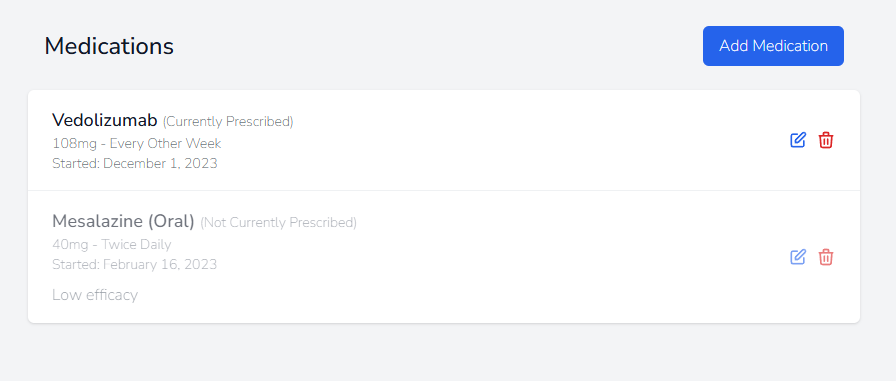

# Expert Patient - UC Expert - Ulcerative Colitis Patient Management System

Expert Patient is a comprehensive Django-based web application designed to help patients with Bowel disease (Currently only Ulcerative Colitis (UC)) manage their condition effectively. It provides tools for tracking symptoms, medications, food triggers, and offers AI-powered chat support for UC-related questions which are answered solely within the context of provided medical knowledge and the users current logged disease state.


## Pre-Development

<details>
<summary>The Idea</summary>
<br>
I settled on a challenging goal: create a comprehensive Bowel Disease management tool that currently focuses only on Ulcerative Colitis, incorporating advanced AI chat capabilities through a RAG (Retrieval Augmented Generation) system. While RAG might seem "overkill" for the initial scope, it was chosen for:
<br>
<br>

- Learning opportunity in AI integration
- Future scalability for multiple medical conditions
- Potential for modular reuse
- Enhanced user support capabilities
- Control over LLM responses

Once the UC part of the app is complete it can be easily scaled for patients with other bowel diseases such as Chron's Disease or Microscopic Colitis.
<br>
<br>
</details>

<details>
<summary>Why Expert Patient?</summary>
<br>
After having conversation with the medical director of InVita intelligence at my bootcamp orientation, I noticed a misalignment between doctors and their patients on a particular idea. Mark explained to me how doctors value "Expert Patients". Having a patient who understands their condition well is beneficial to the doctor, as what is reported to them tends to be more accurate and relevant. I did some research among family, friends and peers, and learned that this notion is not realised by many people suffering from some form of affliction that is regularly monitored by their doctor. They feel as though, if anything, they are pushed away from understsnding the exact workings of their condition, and are simply told what to monitor and how to do it. This works well for many dilligent patients, but reseacrch suggested that some feel a disconnect. They want to understand their illness in depth, but may feel "stupid" when speaking to a doctor regarding recent developments in symptoms or when they bring up things they may think are of note. 
<br>
<br>
UC expert was born of my own experience in this area and response I received from others. It aims to turn patients into experts on their condition by allowing them to interact with an AI, regarding not just general information on the disease, but specific information relating to their current symptoms and state of their condition. They can ask the "stupid" questions they may prefer not to ask their doctor, gain re-assurance on particular issues, gain a deeper understanding of what may be causing them and have a record of symptoms they can then talk more confidently with their doctor about. The AI must re-direct to a mecical professional when the users interaction warrants it.
<br>
<br>
</details>


<details>
<summary>The Prototype Introduction</summary>
<br>
Before I started the capstone project I decided to build a prototype using AI. This is a methodology I have adopted that allows me to ideate, validate, and test in a rapid and cutting edge manner. The new capabilities of LLM's and IDE's with native LLM integration allow for a this novel approach, which provides many advantages.
 <br>
 <br>
In order to do so I undertake initial research on the technologies required to build the app I have in mind, as you would expect. However, I then use this research to develop a comprehensive pseudocode style plan that will prompt an IDE native LLM to build the app. Once the prototype is complete I can quickly alter elements, iterate on possible features or improve existing ones, all while testing it's capabilities to see if it is performing as I expect. This allows me to interact with any product idea I have very quickly. It leads to rapid itterations and more detailed plans including refactoring before I have even written a line of code. I can then use the prototype as a basis to develop the app with minimal AI assitance, as I did with this project. It is a great way to learn a new technology. You gain an understanding of it's architecture and core pinciples without worrying about having to learn the detailed syntax of a particular function, that upon later testing turns out to be reduntant or unused by the user. 
<br>
<br>
</details>


<details>
<summary>The Research Phase</summary>
<br>

- Studied RAG system implementations by watching videos and reading langchain documentation.
- Explored Django best practices and watched tutorials on django architecture and implementation.
- Investigated AI integration options (Local/API and Model choice).

</details>


<details>
<summary>AI-Assisted Learning</summary>

- Used Claude AI for development planning.
- Leveraged Cursor.directory for Django best practice prompts.
- Created comprehensive prompts covering:

    - Django architecture
    - LangChain integration
    - RAG system implementation
    - Tailwind CSS styling
    - Database ERD

</details>


<details>
<summary>AI development</summary>
<br>
Used AI native Cursor IDE to develop the prototype. The main body of this took around an hour. I then developed it further by adding features and refinements until I was happy with it as a proof of concept. 
<br>
It can be found here https://github.com/GuyMitchy/Expert-Patient
<br>
<br>
</details>

<details>
<summary>Technical Validation</summary>
<br>

- Tested RAG using Ollama locally
- Verified basic Django structure
- Validated database relationships
- Assessed UX/UI concepts

</details>

<details>
<summary>The Outcomes</summary>
<br>

- Gained a deeper understanding of django project architecture
- Vaildated proof of concept and viabilty as a potential capstone project candidate.
- Prototype acts as a roadmap and development guide
- Learning opportunity - Native AI with indexed codebase allows me to question "how and why" things are working as they do. Learning as the AI explains syntax and implementation details. 
- LLM monitoring and assesment - Gained a deeper understanding on the capabilty of LLM's. Upon asking for explanations you realise the mistakes it makes (usually overcomplicating things), learning from it's mistakes like I would learn from my own.
- Deeper understanding of the importance of comprehensive planning, realisation that "It's all in the planning"

Once the prototype was complete and my assemment on viabilty was made I chose to proceed with the project.
<br>
<br>
</details>


## Development Plan

### Strategy

<details>
<summary>Primary goals</summary>

<br>

- Help UC patients track and manage their condition effectively by tracking symptoms, medications and Foods.
- Allow users to interact with a chatbot regarding their condition, in order to become an expert patient.
- Focus on creating a reliable, easy-to-use health management tool.
- Enable data-driven conversations with healthcare providers by having a record of their condition.

</details>

<details>
<summary>User Needs</summary>
<br>

- Record and track my symptoms
- Manage my medication regimen
- Get reliable information about my condition
- Track my food intake and understand how it affects my condition
- Have secure access to my medical information
- Have the AI understand my specific condition
- Trust the AI's information
- Have the AI to maintain conversation context

</details>

<details>
<summary>Project requirements</summary>
<br>
The project requirements were taken from the assesment criteria located here (https://docs.google.com/document/d/1hqYa0lJszFtzzyRbjH-BKj2ng5XkNX7oukh9kXo-UM4/edit?tab=t.0)
<br>
<br>
</details>

<details>
<summary>GitHub User Story Populator Utility</summary>
<br>
To efficiently manage the user story development process I created a utility to automatically generate GitHub issues from user stories in .yaml format (https://github.com/GuyMitchy/github-user-story-populator).

This automated approach allowed for:

- Consistent issue formatting
- Automatic label application (Must Have, Should Have, etc.)
- Creation of task checkboxes for acceptance criteria
- Improved development workflow

</details>

<details>
<summary>User Stories</summary>

 #### user_stories.yaml

```yaml
stories:
  - type: Feature
    title: "Symptom Logging System"
    as_a: "UC patient"
    i_want: "to record and track my symptoms"
    so_that: "I can monitor my condition's progression and share accurate information with my healthcare providers"
    priority: "Must Have"
    labels: ["Must Have", "User"]
    acceptance_criteria:
      - "Can select from predefined symptom types (pain, blood, urgency, fatigue, joint pain, diarrhoea, other)"
      - "Can rate severity on a 1-5 scale"
      - "Can add descriptive notes about symptoms"
      - "Can set the date of symptoms"
      - "Can view a list of recorded symptoms"
      - "Can edit or delete existing symptom entries"

  - type: Feature
    title: "Medication Management System"
    as_a: "UC patient"
    i_want: "to manage my medication regimen"
    so_that: "I can maintain consistent treatment and track the effectiveness of different medications"
    priority: "Must Have"
    labels: ["Must Have", "User"]
    acceptance_criteria:
      - "Can add new medications with name, dosage, and frequency"
      - "Can specify medication start date"
      - "Can mark medications as active/inactive"
      - "Can add notes about medications"
      - "Can view complete medication history"
      - "Can edit medication details"
      - "Can delete medication entries"

  - type: Feature
    title: "Basic AI Chat Support"
    as_a: "UC patient"
    i_want: "to get reliable information about my condition"
    so_that: "I can make informed decisions about my daily health management"
    priority: "Must Have"
    labels: ["Must Have", "User"]
    acceptance_criteria:
      - "Can start new conversations with custom titles"
      - "Can receive responses based on verified UC information"
      - "Can view chat history"
      - "Receives emergency guidance for severe symptoms"
      - "Gets redirected to healthcare providers when appropriate"
      - "Can access previous conversations"

  - type: Feature
    title: "Personalized AI Responses"
    as_a: "UC patient"
    i_want: "the AI to understand my specific condition"
    so_that: "I can receive relevant and personalized guidance for my unique situation"
    priority: "Must Have"
    labels: ["Must Have", "User"]
    acceptance_criteria:
      - "AI references user's current medications in responses"
      - "AI considers user's symptom history when giving advice"
      - "AI provides personalized recommendations based on user data"
      - "AI maintains medical context throughout conversation"
      - "AI flags concerning symptom patterns"
      - "AI avoids contradicting user's current treatment plan"

  - type: Feature
    title: "Food Diary Management"
    as_a: "UC patient"
    i_want: "to track my food intake and its effects"
    so_that: "I can identify trigger foods and maintain a diet that minimizes flare-ups"
    priority: "Must Have"
    labels: ["Must Have", "User"]
    acceptance_criteria:
      - "Can log meals with date and time"
      - "Can specify food items consumed"
      - "Can mark foods as 'safe' or 'trigger'"
      - "Can note specific reactions to foods"
      - "Can view food diary history"
      - "Can identify trigger foods through history"
      - "Can edit or delete food diary entries"

  - type: Feature
    title: "User Authentication System"
    as_a: "UC patient"
    i_want: "secure access to my medical information"
    so_that: "I can maintain privacy and confidentiality of my health data"
    priority: "Must Have"
    labels: ["Must Have", "User"]
    acceptance_criteria:
      - "Can register for an account"
      - "Can log in securely"
      - "Can log out"
      - "Can only access own medical data"
      - "Has persistent data across sessions"

  - type: Feature
    title: "Conversation Management"
    as_a: "UC patient"
    i_want: "to organize and review my AI conversations"
    so_that: "I can easily reference previous advice and track my health-related questions over time"
    priority: "Should Have"
    labels: ["Should Have", "User"]
    acceptance_criteria:
      - "Can create titled conversations"
      - "Can view list of all conversations"
      - "Can navigate between different conversations"
      - "Can see timestamp for each message"
      - "Can identify bot vs user messages"

  - type: Feature
    title: "AI Knowledge Verification"
    as_a: "UC patient"
    i_want: "to trust the AI's information"
    so_that: "I can confidently use its guidance in managing my condition"
    priority: "Should Have"
    labels: ["Should Have", "User"]
    acceptance_criteria:
      - "AI clearly indicates when information is not available"
      - "AI provides consistent answers to similar questions"
      - "AI acknowledges medical disclaimer when appropriate"
      - "AI maintains professional medical terminology"
      - "AI correctly categorizes symptom severity"

  - type: Feature
    title: "AI Chat Context Management"
    as_a: "UC patient"
    i_want: "the AI to maintain conversation context"
    so_that: "I can have more meaningful and coherent discussions about my health concerns"
    priority: "Could Have"
    labels: ["Could Have", "User"]
    acceptance_criteria:
      - "AI remembers previous questions in conversation"
      - "AI can reference earlier parts of conversation"
      - "AI maintains consistent advice throughout chat"
      - "AI can clarify previous responses"
      - "AI can update responses based on new information"

  - type: Feature
    title: "Out of Scope Features"
    as_a: "Developer"
    i_want: "to document features that won't be implemented"
    so_that: "we can maintain clear project boundaries"
    priority: "Wont Have"
    labels: ["Wont Have", "Developer"]
    acceptance_criteria:
      - "Medication reminders/scheduling"
      - "Disease state report creation"
      - "Direct healthcare provider communication"
      - "File upload for medical documents"
      - "Integration with medical devices/apps"
      - "Real-time symptom alerts"
      - "Automated meal planning"
      - "Social features or community support"
      - "Integration with electronic health records"
      - "Expansion for other bowel diseases"

     
  # LO1: Agile Planning and Design
  - type: Feature
    title: "Front-End Design Implementation"
    as_a: "Developer"
    i_want: "to implement accessible and responsive front-end design"
    so_that: "the application meets WCAG guidelines and provides a consistent user experience"
    priority: "Must Have"
    labels: ["Must Have", "Developer"]
    acceptance_criteria:
      - "Implement semantic HTML5 elements throughout (header, nav, main, footer, etc.)"
      - "Pass WCAG validation with no errors"
      - "Implement responsive design using CSS Grid/Flexbox/Media Queries"
      - "Ensure consistent styling across all pages"
      - "Verify functionality across different screen sizes (mobile, tablet, desktop)"
      - "Implement clear navigation structure"
      - "Use Bootstrap or custom CSS framework consistently"

  - type: Feature
    title: "Database Structure Implementation"
    as_a: "Developer"
    i_want: "to implement a Django database-backed application"
    so_that: "data can be efficiently managed and stored"
    priority: "Must Have"
    labels: ["Must Have", "Developer"]
    acceptance_criteria:
      - "Configure Django application with PostgreSQL database"
      - "Create at least one custom model meeting project requirements"
      - "Implement proper field types and relationships"
      - "Configure model constraints and validation"
      - "Implement efficient database queries using Django's ORM"
      - "Document model relationships in README"

  - type: Feature
    title: "Agile Project Management Implementation"
    as_a: "Developer"
    i_want: "to maintain an active Agile project management system"
    so_that: "project progress is tracked and documented"
    priority: "Must Have"
    labels: ["Must Have", "Developer"]
    acceptance_criteria:
      - "Set up project board (GitHub Projects or similar)"
      - "Create and maintain user stories with clear acceptance criteria"
      - "Link all stories to project goals"
      - "Update board regularly showing sprint progress"
      - "Document Agile process in README"
      - "Include screenshots of board progression"

  - type: Feature
    title: "Code Quality Standards"
    as_a: "Developer"
    i_want: "to implement high-quality Python code"
    so_that: "the application is maintainable and reliable"
    priority: "Must Have"
    labels: ["Must Have", "Developer"]
    acceptance_criteria:
      - "Implement custom Python logic with compound statements"
      - "Follow PEP 8 style guidelines"
      - "Use consistent naming conventions (snake_case for Python)"
      - "Include comprehensive docstrings for all functions/classes"
      - "Add explanatory comments for complex logic"
      - "Maintain consistent indentation"
      - "Use descriptive variable and function names"

  - type: Feature
    title: "UX Design Documentation"
    as_a: "Developer"
    i_want: "to document the UX design process"
    so_that: "design decisions are clearly understood"
    priority: "Must Have"
    labels: ["Must Have", "Developer"]
    acceptance_criteria:
      - "Create wireframes for all pages (mobile and desktop)"
      - "Develop visual mockups showing color schemes"
      - "Document user stories and acceptance criteria"
      - "Include design process reasoning in README"
      - "Document all major design changes and rationale"
      - "Include sitemap or information architecture diagram"

  # LO2: Data Model and Business Logic
  - type: Feature
    title: "Database Development"
    as_a: "Developer"
    i_want: "to implement a consistent database structure"
    so_that: "data integrity is maintained"
    priority: "Must Have"
    labels: ["Must Have", "Developer"]
    acceptance_criteria:
      - "Design normalized database schema"
      - "Document table relationships with ERD"
      - "Implement appropriate data types and constraints"
      - "Create and maintain database migrations"
      - "Document database schema in README"
      - "Implement proper indexes for performance"

  - type: Feature
    title: "Enhanced CRUD Implementation"
    as_a: "Developer"
    i_want: "to implement comprehensive CRUD functionality"
    so_that: "users can effectively manage data"
    priority: "Must Have"
    labels: ["Must Have", "Developer"]
    acceptance_criteria:
      - "Implement Create operations with validation"
      - "Implement Read operations with filtering/search"
      - "Implement Update operations with validation"
      - "Implement Delete operations with confirmation"
      - "Add success/error messages for all operations"
      - "Implement proper access controls for each operation"
      - "Add defensive programming checks"

  - type: Feature
    title: "User Notification System"
    as_a: "Developer"
    i_want: "to implement a comprehensive notification system"
    so_that: "users are informed of relevant changes"
    priority: "Must Have"
    labels: ["Must Have", "Developer"]
    acceptance_criteria:
      - "Implement real-time/near-real-time notifications"
      - "Show success messages for all CRUD operations"
      - "Implement error notifications"
      - "Create notification queue system"
      - "Allow users to manage notification preferences"
      - "Ensure notifications are user-specific"
      - "Document notification types in README"

  - type: Feature
    title: "Form Implementation"
    as_a: "Developer"
    i_want: "to implement validated forms"
    so_that: "data integrity is maintained"
    priority: "Must Have"
    labels: ["Must Have", "Developer"]
    acceptance_criteria:
      - "Implement Django forms for all data entry"
      - "Add client-side validation where appropriate"
      - "Implement server-side validation"
      - "Show clear error messages"
      - "Style forms consistently"
      - "Make forms accessible (ARIA labels, etc.)"
      - "Handle form submission errors gracefully"

  # LO3: Authentication and Authorization
  - type: Feature
    title: "Enhanced Authentication System"
    as_a: "Developer"
    i_want: "to implement a secure authentication system"
    so_that: "user access is properly controlled"
    priority: "Must Have"
    labels: ["Must Have", "Developer"]
    acceptance_criteria:
      - "Implement secure user registration"
      - "Create role-based login system"
      - "Add password reset functionality"
      - "Implement email verification"
      - "Show clear login state indicators"
      - "Protect routes based on authentication"
      - "Implement proper session management"
      - "Add secure password handling"
      - "Document authentication flow in README"

  # LO4: Testing
  - type: Feature
    title: "Comprehensive Testing Implementation"
    as_a: "Developer"
    i_want: "to implement thorough testing"
    so_that: "application reliability is verified"
    priority: "Must Have"
    labels: ["Must Have", "Developer"]
    acceptance_criteria:
      - "Write Python unit tests for models"
      - "Create view tests for all CRUD operations"
      - "Implement form validation tests"
      - "Create JavaScript tests (if applicable)"
      - "Document manual testing procedures"
      - "Include testing coverage report"
      - "Document all testing in README"

  # LO5: Version Control
  - type: Feature
    title: "Enhanced Version Control"
    as_a: "Developer"
    i_want: "to maintain proper version control"
    so_that: "code changes are tracked securely"
    priority: "Must Have"
    labels: ["Must Have", "Developer"]
    acceptance_criteria:
      - "Write meaningful commit messages"
      - "Make regular, atomic commits"
      - "Use feature branches for development"
      - "Implement proper .gitignore"
      - "Secure sensitive information"
      - "Document branching strategy"
      - "Maintain clean commit history"

  # LO6: Deployment
  - type: Feature
    title: "Enhanced Deployment Process"
    as_a: "Developer"
    i_want: "to implement secure deployment procedures"
    so_that: "the application runs correctly in production"
    priority: "Must Have"
    labels: ["Must Have", "Developer"]
    acceptance_criteria:
      - "Deploy successfully to cloud platform"
      - "Configure production database"
      - "Set up environment variables"
      - "Disable Debug mode in production"
      - "Implement proper error handling"
      - "Document deployment process"
      - "Configure static file serving"

  # LO7: Custom Data Models
  - type: Feature
    title: "Enhanced Custom Data Model"
    as_a: "Developer"
    i_want: "to implement custom data models"
    so_that: "specific project requirements are met"
    priority: "Must Have"
    labels: ["Must Have", "Developer"]
    acceptance_criteria:
      - "Design models to fit project needs"
      - "Implement proper model relationships"
      - "Add custom model methods"
      - "Document model architecture"
      - "Implement proper validation"
      - "Add custom querysets if required"
```
<br>
<br>
</details>

</details>

### Scope

<details>
<summary>Authentication System</summary>
<br>

- Django AllAuth Authentication
- Email-based registration and login (remove username)
- Password validation
- Session management
- Access control to personal data

</details>


<details>
<summary>Symptom Tracking System</summary>
<br>

This system will enable UC patients to maintain a comprehensive log of their symptoms for monitoring disease progression and sharing with healthcare providers. The structured format ensures consistent tracking of critical health indicators.
<br>

#### Model

```python
Required Fields:
- User (ForeignKey)
- Date (DateField)
- Type (CharField with choices):
    - Abdominal Pain
    - Blood in Stool
    - Urgency
    - Diarrhoea
    - Fatigue
    - Joint Pain
    - Other
- Severity (IntegerField 1-5):
    - Very Mild
    - Mild
    - Moderate
    - Severe
    - Very Severe
- Description (TextField)
```

</details>

<details>
<summary>Medication Management System</summary>
<br>
This system will help patients track their UC medication regimen, ensuring accurate records of current and historical treatments. It supports all major UC medication categories and various dosing schedules.
<br>

#### Model

```python
Required Fields:
- User (ForeignKey)
- Name (CharField with categories):
    - 5-ASAs
    - Corticosteroids
    - Immunomodulators
    - Biologics
    - JAK Inhibitors
- Dosage (CharField)
- Frequency (CharField with choices):
    - Daily
    - Twice Daily
    - Three Times Daily
    - Four Times Daily
    - Weekly
    - Every Other Week
    - Monthly
    - As Needed
- Start Date (DateField)
- Active Status (BooleanField)
- Notes (TextField)
```

</details>


<details>
<summary>Food Diary System</summary>
<br>

This system allows patients to monitor their diet and identify potential trigger foods. It includes detailed timing and portion information to help establish patterns between diet and symptoms.
<br>
 
 #### Model

```python
Required Fields:
- User (ForeignKey)
- Date (DateTimeField)
- Eaten At (TimeField)
- Meal Type (CharField):
    - Breakfast
    - Lunch
    - Dinner
    - Snack
- Food Name (CharField)
- Portion Size (CharField)
- Is Trigger (BooleanField)
- Notes (TextField)
```

</details>


<details>
<summary>AI Chat System Requirements</summary>
<br>
A context-aware chat system that provides personalized UC management guidance based on user data and verified medical information. It must manage persistent messages across multiple conversations
<br>

#### Conversation Management Model

```python
Required Fields:
- User (ForeignKey)
- Title (CharField)
- Created/Updated timestamps
```

#### Message Management Model
```python
Required Fields:
- Conversation (ForeignKey)
- Content (TextField)
- Is Bot (BooleanField)
- Created timestamp
```

#### RAG System Requirements
- Knowledge Base Content:
  - UC medical information
  - Medication details
  - Emergency guidance
  - Dietary information
  - Lifestyle management
  
- Vector Database Requirements:
  - Document chunking (250 char chunks)
  - Chunk overlap (25 chars)
  - Embedding storage
  - Efficient retrieval

- Context Management:
  - Verified medical UC knowledge
  - User symptom history
  - Current medications
  - Recent food entries
  - Conversation history

</details>


<details>
<summary>UI/UX Requirements</summary>

#### Navigation
- Fixed top navigation bar
- Mobile-responsive menu
- Quick access to main features through dashboard cards
- Consistent back navigation

#### Forms
- Clear error messages
- Input validation
- Date selection controls
- Mobile-friendly inputs

#### Lists and History Views
- Chronological ordering
- Filtering capabilities
- Clear data presentation
- Edit/Delete functionality

#### Responsive Design
- Mobile-first approach
- Tailwind breakpoints:
  - md: 768px
  - lg: 1024px

</details>


<details>
<summary>Content Requirements</summary>

#### Medical Knowledge Base
- Markdown format for reliable vector storage and retrieval
- Core UC information
- Medication details and usage
- Emergency response guidance
- Dietary recommendations
- Lifestyle management advice

#### User Guidance
- Feature usage instructions
- Data entry guidelines
- Emergency information
- Privacy policies
- Terms of service

#### System Messages
- Welcome messages
- Confirmation alerts
- Error notifications
- Success feedback


</details>

<details>
<summary>Future Content/Features</summary>
<br>

- Medication reminders
- Direct healthcare provider communication
- Medical document upload
- Automated meal planning
- Community support features
- Disease state report creation
- Expanded knowledge documents

</details>

### Structure
<details>
<summary>Overview</summary> 
<br>

- Dashboard-centered design for quick access to all features.
- Cards to decribe and navigate to each feature.
- Clear navigation to each section always available via navbar.
- Consistent layout across all features.
- Footer section providing usage information, policies and disclaimers.
- Data entry forms(add, delete and edit) for each feature
- Historical list pages for each feature.
- Chat windows for each conversation with persistent chat history.

</details>


<details>
<summary>Site Map</summary>

#### Non-Authenticated
- Landing Page
  - Login
  - Register
  - About UC Expert
  - Privacy Policy

#### Authenticated Users

#### Header
- Logo/Brand
- Navigation Menu
- User Welcome
- Logout Option

#### Dashboard (Home)
- Quick Access Cards
  - Symptom Tracker
  - Medication Log
  - Food Diary
  - Chat with UC Expert

#### Symptom Management
- List View
  - Add new Symptom button - links to form
  - View all Symptoms in reverse order
  - Edit/Delete buttons - link to forms
  - Add confirmation
  - Delete Confirmation

#### Medication Management
- List View
  - Add New Medication button - links to form
  - View All Medications in reverse order
  - Active/Inactive Filter - shows greyed if inactive
  - Edit/Delete buttons - link to forms
  - Add confirmation
  - Delete Confirmation

#### Food Diary
- List View
  - Add New Entry - link to form
  - View All Entries in reverse order
  - Edit/Delete buttons - link to forms
  - Add confirmation
  - Delete Confirmation

#### Chat System
- List View
  - Start New Converstion
  - View Previous Conversations in reverse order
  - Delete button - links to form
- Chat Detail
  - Chat window
  - Message History
  - Message Input Area
  - Back to conversations button - links to list view

</details>


<details>
<summary>Database Relationships</summary>
<br>

The application will use Django's built-in authentication system and implement the following database structure:

```
User
└── Symptoms (One-to-Many)
└── Medications (One-to-Many)
└── Foods (One-to-Many)
└── Conversations (One-to-Many)
    └── Messages (One-to-Many)
```

#### User (Django's built-in User model)

- Acts as the central model for user authentication and relationships
- Each user can have multiple records in other models


#### Symptoms: One-to-Many relationship with User

- Each user can log multiple symptoms
- Records type, severity, date, and description
- Include validation to prevent future dates

#### Medications: One-to-Many relationship with User

- Tracks multiple medications per user
- Stores medication details including name, dosage, frequency
- Include active/inactive status and start date

#### Foods: One-to-Many relationship with User

- Allows users to maintain a food diary
- Records meal type, portion size, and trigger status
- Include timestamps for precise tracking


#### Conversations: One-to-Many relationship with User

- Each user can have multiple chat conversations
- Stores conversation metadata and title


#### Messages: One-to-Many relationship with Conversation

- Stores individual messages within conversations
- Differentiates between user and bot messages
- Maintains chronological order


All models include appropriate timestamps and custom string representations for admin interface clarity.

<br>

</details>


<details>
<summary>RAG System Architecture</summary>
<br>

```
knowledge/
├── manager.py (Singleton Pattern)
│   ├── RAGManager
│   │   ├── _instance (Single RAG instance)
│   │   ├── get_instance() (Get/create RAG instance)
│   │   └── cleanup() (Resource management)
│   └── with_rag decorator (Handles RAG instance injection)
│
├── rag_setup.py (System Configuration)
│   └── UCExpertRAG
│       ├── __init__
│       │   ├── OpenAI embeddings setup
│       │   ├── Pinecone vector store initialization
│       │   └── Chat prompt template configuration
│       ├── initialize_documents()
│       │   ├── Document loading
│       │   ├── Text splitting (250 char chunks)
│       │   └── Vector store population
│       ├── get_diverse_documents()
│       │   └── Similarity search functionality
│       └── get_response()
│           ├── Context building
│           ├── Response generation
│           └── Error handling
│
└── docs/
    └── core_knowledge.md
        ├── Emergency Information
        ├── Symptoms
        ├── Monitoring
        ├── Diet
        ├── Lifestyle
        ├── Support
        └── Medications
```

### RAG System Data Flow
1. Initialization
   ```python
   # Single instance creation via decorator
   @with_rag
   def send_message(request, conversation_id, rag=None):
       # rag parameter automatically injected
   ```

2. Knowledge Processing
   ```python
   # Document processing
   text_splitter = RecursiveCharacterTextSplitter(
       chunk_size=250,
       chunk_overlap=25,
       separators=["\n## ", "\n### ", "\n", " ", ""]
   )
   ```

3. Context Building
   ```python
   # User context structure
   user_context = """
   User Context:
   - Recent Symptoms
   - Current Medications
   - Food Diary Entries
   
   Conversation History:
   - Previous Messages
   """
   ```

4. Response Generation Pipeline


5. Resource Management
   ```python
   # Cleanup on shutdown
   atexit.register(RAGManager.cleanup)
   ```

6. Error Handling
   ```python
   try:
       response = rag.get_response(
           question=user_message,
           user_info=user_context,
           conversation_history=conversation_history
       )
   except Exception as e:
       # Error handling and logging
   ```

</details>

<details>
<summary>User Flow</summary>

1. Authentication
   - Register/Login
   - Redirect to Dashboard

2. Dashboard Navigation
   - Access to main features

3. Feature Workflows
   - List View Entry
   - Create New Entry
   - View/Edit Details
   - Delete Confirmation

4. Chat Interaction
   - Start/Continue Conversation
   - Receive Contextual Responses
   - Emergency Guidance When Needed

</details>

### Skeleton
<details>
<summary>Wireframes</summary>
<br>

#### Home page

Desktop

Mobile


#### Symptoms List (Same structure for medications, foods, and chat)

Desktop

Mobile


#### Chat Window
Desktop

Mobile


<br>
<br>
</details>

<details>
<summary>ERD</summary>


```mermaid
erDiagram
    User ||--o{ Symptom : logs
    User ||--o{ Medication : manages
    User ||--o{ Conversation : has
    User ||--o{ FoodDiary : records
    Conversation ||--o{ Message : contains

    User {
        int id PK
        string username
        string email
        string password
    }

    Symptom {
        int id PK
        int user_id FK
        date date
        string type
        int severity
        text description
    }

    Medication {
        int id PK
        int user_id FK
        string name
        string dosage
        string frequency
        date start_date
        boolean active
        text notes
        datetime created_at
        datetime updated_at
    }

    FoodDiary {
        int id PK
        int user_id FK
        datetime eaten_at
        string meal_type
        string food_name
        string portion_size
        boolean is_trigger
        text notes
        datetime created_at
        datetime updated_at
    }

    Conversation {
        int id PK
        int user_id FK
        string title
        datetime created_at
        datetime updated_at
    }

    Message {
        int id PK
        int conversation_id FK
        text content
        boolean is_bot
        datetime created_at
    }
   ```
<br>
<br>
</details>

<details>
<summary>Interactive Elements</summary>

#### Buttons
- Primary Actions (Add, edit, save)
- Secondary Actions (Cancel, Back)
- Destructive Actions (Delete)
- Icon Buttons (Edit, Delete)

#### Forms
- Text Inputs
- Select Dropdowns
- Date/Time Pickers
- Checkboxes
- Text Areas

#### Feedback Elements
- Success Messages
- Error Alerts
- Loading States
- Confirmation Dialogs

</details>

### Surface

<details>
<summary>Overview</summary>
<br>

- Medical-inspired blue color scheme for professionalism and trust
- High contrast for readability
- Clear visual feedback for user actions
- Consistent use of Tailwind CSS for styling
- Familiar chat window with colour coded message boxes
- Nunito sans font for professional look

</details>

<details>
<summary>Visual Design Elements</summary>

#### Color Palette
```css
Primary Colors:
- Medical Blue: #2563eb (Tailwind blue-600)
- White: #ffffff
- Success Green: #16a34a (Tailwind green-600)
- Warning Yellow: #ca8a04 (Tailwind yellow-600)
- Error Red: #dc2626 (Tailwind red-600)

Background Colors:
- Light Gray: #f3f4f6 (Tailwind gray-100)
- Card White: #ffffff
- Hover States: #1d4ed8 (Tailwind blue-700)

Message Colors:
- Bot Message: #dbeafe (Tailwind blue-100)
- User Message: #dcfce7 (Tailwind green-100)
```

#### Typography

I will use Nunito Sans as the primary font for UC Expert due to its excellent readability and professional appearance. As a medical support application, it is crucial to select typography that would be both accessible and trustworthy.
Nunito Sans offers several characteristics that make it ideal for this application:

- Clean, modern letterforms that maintain legibility at various sizes
- Well-balanced characters that reduce eye strain during extended reading
- Professional appearance that reinforces the medical nature of the application
- Excellent rendering across different devices and screen sizes
- Strong accessibility characteristics for users with visual impairments

The font will implemented site-wide to maintain consistency across all pages and components, contributing to a cohesive and professional user experience.
This choice aligns with the application's goal of providing clear, accessible health information while maintaining a professional medical aesthetic.
<br>
<br>
</details>

<details>
<summary>Component Styling</summary>

##### Cards
- White background
- Shadow effect
- Rounded corners
- Hover state with increased shadow
- Transition effects

##### Forms
- Input fields with rounded borders
- Focus states with blue outline
- Clear error states with red highlighting
- Success states with green confirmation

##### Buttons
Primary:
- Blue background
- White text
- Hover darkening
- Rounded corners

Secondary:
- White background
- Gray border
- Blue text
- Hover background light blue

Destructive:
- Red background
- White text
- Hover darkening

</details>

<details>
<summary>Responsive Behavior</summary> 

#### Mobile Adaptations
- Stack layouts vertically
- Simplify navigation to burger menu

#### Desktop Enhancements
- Multi-column layouts
- Hover effects
- Extended navigation

</details>

<details>
<summary>Accessibility Considerations</summary>


#### Color Contrast
- All text meets WCAG 2.1 requirements
- Clear distinction between interactive elements
- No color-only information indicators

#### Interactive Elements
- Clear focus states
- Adequate sizing for touch targets
- Consistent interaction patterns

#### Text Readability
- Sufficient font sizes
- Adequate line spacing
- Proper contrast ratios

</details>


## Deployed Project 

### Existing Features

<details>
<summary>Authentication and user accounts</summary>

<br>

Provides secure access to personal medical data through user-specific accounts.

Fulfills "User Authentication System" user story

- ✓ Can register for an account
- ✓ Can log in securely
- ✓ Can log out
- ✓ Can only access own medical data
- ✓ Has persistent data across sessions


<br>
<br>
</details>

<details>
<summary>Navigation Bar</summary>
<br> 

- Permanent navigation bar with links to dashboard and all list pages for each feature.
- Mobile burger menu for hidden navigation
- Sliding mobile navigation menu


<br>
</details>

<details>
<summary>Symptom Tracking</summary>
<br>

Allows users to monitor and record their UC symptoms with detailed information and severity tracking.

Fulfills "Symptom Logging System" user story:

- ✓ Can select from predefined symptom types (pain, blood, urgency, fatigue, joint pain, other)
- ✓ Can rate severity on a 1-5 scale
- ✓ Can add descriptive notes about symptoms
- ✓ Can set the date of symptoms
- ✓ Can view a list of recorded symptoms
- ✓ Can edit or delete existing symptom entries


<br>
<br>
</details>

<details>
<summary>Medication Management</summary>
<br>

Enables tracking of all UC medications with detailed information about dosage, frequency, and active status.
 
Fulfills "Medication Management System" user story:

- ✓ Can add new medications with name, dosage, and frequency
- ✓ Can specify medication start date
- ✓ Can mark medications as active/inactive
- ✓ Can add notes about medications
- ✓ Can view complete medication history
- ✓ Can edit medication details
- ✓ Can delete medication entries



<br>
<br>
</details>

<details>
<summary>Food Diary</summary>
<br>
Comprehensive food tracking system that helps identify trigger foods and track reactions.

Fulfills "Food Diary Management" user story:

- ✓ Can log meals with date and time
- ✓ Can specify food items consumed
- ✓ Can rate digestive comfort after meals (1-5 scale)
- ✓ Can note specific reactions to foods
- ✓ Can view food diary history
- ✓ Can identify trigger foods through history
- ✓ Can edit or delete food diary entries


<br>
<br>
</details>

<details>
<summary>AI Chat Support</summary>
<br>

An intelligent chat system that provides personalized UC management support using the user's health data and medical knowledge documents for context.

Fulfills "Basic AI Chat Support" user story:

- ✓ Can start new conversations with custom titles
- ✓ Can receive responses based on verified UC information
- ✓ Can view chat history
- ✓ Receives emergency guidance for severe symptoms
- ✓ Gets redirected to healthcare providers when appropriate
- ✓ Can access previous conversations

Fulfills "Personalized AI Responses" user story:

- ✓ AI references user's current medications in responses
- ✓ AI considers user's symptom history when giving advice
- ✓ AI provides personalized recommendations based on user data
- ✓ AI maintains medical context throughout conversation
- ✓ AI flags concerning symptom patterns
- ✓ AI avoids contradicting user's current treatment plan

Fulfills "Conversation Management" user story:

- ✓ Can create titled conversations
- ✓ Can view list of all conversations
- ✓ Can navigate between different conversations
- ✓ Can see timestamp for each message
- ✓ Can identify bot vs user messages

Fulfills "AI Knowledge Verification" user story:

- ✓ AI clearly indicates when information is not available
- ✓ AI provides consistent answers to similar questions
- ✓ AI acknowledges medical disclaimer when appropriate
- ✓ AI maintains professional medical terminology
- ✓ AI correctly categorizes symptom severity

Fulfills "AI Chat Context Management" user story:

- ✓ AI remembers previous questions in conversation
- ✓ AI can reference earlier parts of conversation
- ✓ AI maintains consistent advice throughout chat
- ✓ AI can clarify previous responses
- ✓ AI can update responses based on new information


</details>

### Tech Stack and Security Considerations

<details>
<summary>Tech Stack</summary>

#### Backend

- Django 5.1.3: Primary web framework
- Python: Core programming language
- PostgreSQL: Production database
- SQLite: Development database
- OpenAI API (GPT-4): LLM for chat responses
- Pinecone: Vector database for RAG system
- Django AllAuth: Authentication system

#### Frontend

- HTML5: Semantic markup
- Tailwind CSS: Utility-first styling
- JavaScript: Interactive elements
- WhiteNoise: Static file serving

#### Development Tools

- dj-database-url: Database configuration
- python-dotenv: Environment management
- Django Debug Toolbar: Development debugging

#### RAG System Components

- LangChain: RAG implementation framework
- OpenAI Embeddings: Document vectorization
- Pinecone Vector Store: Vector storage and retrieval
- RecursiveCharacterTextSplitter: Document chunking
- ChatPromptTemplate: Response generation

#### Deployment

- Heroku: Cloud platform hosting
- Gunicorn: WSGI HTTP Server
- WhiteNoise: Static file serving in production


</details>

<details>
<summary>Security Considerations</summary>

#### Authentication & Authorization

- Email-based authentication using Django AllAuth
- Login required mixins for all views
- User-specific querysets ensuring data isolation
- CSRF protection enabled globally
- Secure password hashing with Django's auth system

#### Data Protection

- User data segregation through ForeignKey relationships
- Database access controlled through Django ORM
- Sensitive settings stored as environment variables
- Debug mode disabled in production

#### API Security

- OpenAI API key secured in environment variables
- Pinecone API key protected in environment variables
- RAG system access controlled through decorators

#### Form Security

- Server-side validation on all forms
- Client-side validation for better UX on date entry
- XSS protection through Django's template system
- Secure file upload handling

#### Deployment Security

- SECRET_KEY stored in environment variables
- ALLOWED_HOSTS configured for production
- Secure HTTPS connection enforced
- WhiteNoise for secure static file serving

#### Chat System Security

- RAG responses limited to verified medical information
- Emergency protocols for severe symptoms
- User data privacy in conversation context
- Proper error handling and logging

</details>

### Added Features

<details>
<summary>Recent Data in Dashboard</summary>
<br>
Allows users to quickly view their recent data. I initially did not identify this as a user need but during sprint 3 I was making good headway and decided it was an easy feature to add so went along with it.

- Overview of recent symptoms, medications, and food entries
- Quick access cards to main features
- Status indicators for active medications and recent symptoms


<br>
<br>
</details>

<details>
<summary>Food model Adjustments</summary>
<br>
 "Disgestive discomfort" field and "Unsure" trigger choice option for "is_trigger" field.
<br>
These adjustments allow the user to more accurately assess their reaction to particular foods and aid the AI in discerning between foods that may or may not be triggering symptoms.
<br>
<br>
</details>

<details>
<summary>SuperUser Admin Button</summary>
<br>

"Admin" button added to navbar for superusers only that allows easy navigation to admin panel without having to alter URL endpoint.


</details>

<details>
<summary>Emergent Report Creation</summary>
<br>
I had originally outlined report creation as a "Won't Have" feature, but upon testing the RAG sytem I identified the capabilty of the AI to dynamically generate reports based on the user context it is given.


</details>

### Future Features

</details>

<details>
<summary>All</summary>
<br>

- Medication reminders/schedulin
- Direct healthcare provider communication/access
- File upload for medical documents
- Medication interaction checking
- Automated meal planning
- Social features/community support
- Integration with electronic health records

</details>


## Version Control

<details>
<summary>Git</summary>
<br>
I used Git for version control. I protected the main branch and tried to only work on feature branches to aid in maintaining a clean commit history.

#### Branching Strategy

##### Feature Branches

- Main - Set up initial Django prject structure, Urls and settings
- Database-and-deploy - For switching from sqlLite to Postgres and initial deploy
- home-branch - For home app features
- foods-app - For foods app features
- medication-app - For medication app features
- symptom-app - For symptom app features
- chat-and-rag - For RAG sytem development and chat app features
- testing - For automated tests and fixes based off of test results

##### Styling Branches

- Auth-Style-Branch - For styling the AllAuth templates
- styling-branch - For overall styling once the mvp was complete

##### Bug Branches

- deploy-proxy-bug - Branch made for particular proxy bug relating to pinecone on deploy.

##### Cleanup Branch

- cleanup - Branch for cleaning up and polishing elements across all features
<br>

</details>


## Agile

<details>
<summary>Methodology</summary>
<br>
I took an agile approach towards the development of this project. I created user stories from defined user needs and created issues and a project board on GitHub. The user stories were given labels relating to MoSCoW Prioritisation. I approached the development of UC Expert through 5 distinct sprints, each focusing on specific aspects of the application. While the sprint breakdown below appears highly structured, the actual development process was more dynamic and responsive. Following agile principles, particularly the value of "Responding to change over following a plan" from the Agile Manifesto, I adapted my development approach as new challenges and requirements emerged. The sprint structure presented here is a retrospective organization of the development journey, showing how the project evolved through iterative development and continuous problem-solving.

This approach aligns closely with agile principles, particularly:

- Embracing changing requirements, even late in development
- Delivering working software frequently
- Technical excellence and good design
- Regular adaptation to changing circumstances

Starting with a core vision of a comprehensive UC management system, I built the project incrementally, tackling technical challenges as they arose. For example, the food diary evolved to include more sophisticated tracking options based on development insights, and the AI implementation underwent several optimizations as deployment challenges became apparent. This organic, responsive development style allowed me to create a more robust and user-focused application than a rigid, pre-planned approach might have achieved.

</details>

<details>
<summary>Sprints</summary>

#### Sprint 1: Foundation & Authentication

I began with setting up the project foundations and user authentication. My first priority was ensuring users could securely access their personal health data. I:

- Set up the Django project with initial configurations
- Implemented AllAuth for secure authentication
- Created custom login/signup templates
- Built a responsive base template with navigation
- Configured email-based login for better security
- Set up proper CSRF protections and security settings

#### Sprint 2: Core Feature Development - Symptoms & Medications

With authentication in place, I moved on to building the core health tracking features. During this sprint, I:

- Built the complete symptom logging system with CRUD functionality
- Developed the medication management system
- Created reusable templates for consistent user experience
- Implemented comprehensive form handling with validation
- Focused on following Django's "fat models, thin views, stupid templates" philosophy - (This is where I refactored the form handling logic from templates to forms.py files)
- Added user feedback systems for all operations

#### Sprint 3: Food Diary & Enhanced Features

Next, I developed the food diary system and enhanced the user interface. I:

- Implemented the food diary with trigger food tracking
- Added discomfort level monitoring for food entries
- Built a dashboard showing recent entries from all trackers (This is an added feature not identified in my plan)
- Enhanced the UI with responsive cards
- Added quick-add buttons for improved user experience
- Implemented consistent styling across all features

#### Sprint 4: AI Integration & Optimization
The most complex feature was the AI chat system. During this sprint, I:

- Implemented the RAG (Retrieval-Augmented Generation) system
- Built conversation management features
- Optimized memory usage for deployment
- Created a system for contextual responses based on user data
- Added loading states for better user experience
- Implemented proper error handling for the AI system

#### Sprint 5: Cleanup, Testing & Polish (Dec 8-9)

In the final sprint, I focused on polishing the application and ensuring everything met high standards. I:

- Set up admin panels for all apps
- Added footer links and legal templates
- Creating automated tests for each app apart from the RAG knowledge app
- Ran the deployed app through validation checkers
- Made accessibility improvements
- Corrected header element ordering
- Added aria labels to buttons
- Fixed various styling issues
- Added superuser access to admin panel
- Updated landing page text and messaging
- Added admin panel access from the navbar for superusers

Throughout development, I maintained an agile approach, regularly committing changes and iterating based on testing and user experience considerations. Each sprint built upon the previous ones, gradually transforming UC Expert from a basic health tracker into a comprehensive patient support system. 
<br>
<br>
</details>

<details>
<summary>Project Board</summary>
<br>
I created a backlog colummn for my project board and populated it with all of my user stories. I worked on groups of related stories sequentially according to my sprint strategy, moving them across the board until all criteria were satisfied.
<br>


</details>

## Testing and Validation

<details>
<summary>Manual Testing</summary>
<br>

Manual testing was conducted on all features across different browsers:

- Chrome
- Firefox
- Safari
- Edge

Key test scenarios were executed across all browsers:

Form Submissions:

- Tested all forms with valid and invalid data
- Verified error message display and validation
- Confirmed successful submission behaviors

Navigation and Routing:

- Tested all navigation links and menu items
- Verified proper URL routing and page loading
- Confirmed browser back/forward button behavior

Medical/Food Data Entry:

- Verified symptom logging functionality
- Tested medication tracking features
- Confirmed food diary entry and retrieval
- Checked data validation and error handling

Chat Interface:

- Tested conversation creation and management
- Verified message sending and receiving
- Confirmed chat history persistence
- Checked AI response generation

Error Handling:

- Tested form validation error messages
- Verified server error handling
- Confirmed user feedback mechanisms

Mobile Responsiveness:

- Tested all features on various screen sizes
- Verified responsive design breakpoints
- Confirmed touch interactions on mobile devices


JavaScript functionality was manually tested across all browsers:

- Mobile Menu Toggle: Verified menu opens/closes correctly on mobile devices and tested responsive behavior across different screen sizes
- Chat Window Auto-scroll: Confirmed chat window automatically scrolls to newest messages
- Lucide Icons: Verified all icons render correctly throughout the application with proper sizing and colors
- Success Message Animation (Home Page Only): Tested success message appearance and automatic timeout when logging in and signing out

All JavaScript features were found to be working as intended across tested platforms.

##### LLM Integration Testing
For the chatbot functionality, which uses OpenAI's API:

- Comprehensive initial prototype testing was conducted using a local LLM to verify the conversation flow and context management
- Production testing is conducted manually and selectively due to API costs

- Regular manual testing is performed on key conversation paths to ensure:

    - Appropriate medical advice is given
    - Context from user's symptoms and medications is properly incorporated
    - Emergency situations are correctly identified and handled
    - Response formatting and presentation is consistent

</details>

<details>
<summary>Automated Testing</summary>
<br>

I implemented comprehensive automated testing using Django's testing framework. Each app has its own test suite focusing on specific functionality:


##### User Authentication and Registration

See tests/test_auth.py

- Signup page functionality
- User registration process
- Login and logout functionality
- Password validation rules
- Email requirement validation
- Authentication state redirects
- Form validation messages


##### Symptoms App

See symptoms/tests.py

- Model creation and validation
- Future date prevention
- CRUD operations (Create, Read, Update, Delete)
- User-specific data access
- Form submission handling


##### Medications App

See medications/tests.py

- Model creation and validation
- Medication choice field validation
- Active/inactive status tracking
- Future date prevention
- CRUD operations
- User data isolation
- Form field validation


##### Food Diary App

See foods/tests.py

- Model creation and validation
- Meal type choice validation
- Discomfort scale validation
- Trigger food status tracking
- Date/time field validation
- CRUD operations
- User data isolation


##### Chat App

See chat/tests.py

- Conversation model validation
- Message ordering
- User message creation
- Bot message mocking
- CRUD operations for conversations
- User data isolation


<br>
</details>

<details>
<summary>Vaildation</summary>

#### PEP8

I used flake8 to test PEP8 adherence. My code passes on all fronts apart from the RAG_setup.py template prompt having lines over 80 characters. I chose not to split the strings here as the prompt readabilty suffers and edits are made cumbersome. Code created by django fails on many fronts.


#### WCAG Markup Validator

Passes all tests.


#### Lighthouse

The project scores well on lighthouse on all pages.

Areas for improvement: 
Accessbility warnings on the dashboard - 4/8 buttons on the cards have low contrast between the text and background. Making the text more bold would fix this but I decided to keep it as is for styling purposes.


<br>
<br>
</details>


## Bugs, Issues, and Current Limitations
<details>
<summary>Bugs, Issues and Resolutions</summary>
<br>

1. Form handling optimization:
   - Initial issue: Form logic in templates was messy and causing type errors where choices were used in database fields
   - Solution: Implemented "fat models, skinny views, stupid templates" pattern. Moving logic from templates into forms.py
   - Result: Improved code organization, seperation of concerns, maintainability and readabilty.

2. Vector Database Migration:
   - Initial issue: ChromaDB performance on Heroku was casuing multiple instances of the database to be created, increasing memory usage for each site access.
   - Solution: Migrated to Pinecone and vector database cleanup.
   - Result: Improved reliability and scalability

3. Slow inital load time:
   - Initial issue: Website was slow to load home page due to vector database initialisition on access.
   - Solution: Moved database initialisation to send message function.
   - Result: Improved code organization, seperation of concerns, maintainability and readabilty.
   - Future improvement: Move RAG initialisation to chat window load to decrease wait time for first message response.

4. Bug - "Midnight":  
   - Intital issue: "midnight" shows as time for all food entries, followed by the correct user entered time"
   - Solution: Altered datetime field in model to date field only
   - Result: Only user entered time appears

5. Memory Usage Optimization:
   - Initial issue: Memory usage exceeding Heroku's 500MB limit (reaching ~650-680MB) during chat interactions, with memory increasing after each message despite cleanup.
   - Problem identified: Documents were being reinitialized on every message, causing memory accumulation.
   - Solution: Modified RAG system to initialize documents only once when vector store is empty, moved template initialization to correct location in init, and implemented more aggressive cleanup.
   - Result: Proper cleanup after each message, prevention of document reinitialization, better memory management.
   - Future improvement:  Implement batch processing for document chunks or add a timeout mechanism to reinitialize RAG system after periods of inactivity.

6. Bug - Email prefix instead of Username in welcome message:
   - Intital issue: Email prefix instead of username is displayed in welcome message
   - Problem identified: Setting "ACCOUNT_USERNAME_REQUIRED = False" in AllAuth settings is causing django to use email prefix when using {user.username} instead of the username.
   - Solution: Modified AllAuth settings in settings.py to:
      ```python
      ACCOUNT_AUTHENTICATION_METHOD = 'email'  # Keep email-only login
      ACCOUNT_EMAIL_REQUIRED = True
      ACCOUNT_USERNAME_REQUIRED = True  # Changed to True to require username at signup
      ACCOUNT_EMAIL_VERIFICATION = 'none'
   - Result: Users now create a username during registration which is displayed in the welcome message, while still maintaining email-only login functionality. This provides a more personalized user experience while keeping the simplified email-based authentication.

7. Bug - WCG-AG validation error with Lucide icons:
   - Initial issue WCG validation error: "Attribute `stroke-width` not allowed on element `i`"
   - Problem identified: Direct SVG attributes on `<i>` elements violate HTML5 standards, and CSS solutions don't work because Lucide dynamically replaces elements via JavaScript
   - Solution: Implemented a two-part fix:
      1. Added specific class to target icon:
          ```html
          <i data-lucide="activity" class="w-14 h-14 thin-icon"></i>
          ```
      2. Added custom Lucide initialization in base template:
          ```javascript
          lucide.createIcons({
              selector: '.thin-icon',
              attrs: {
                  'stroke-width': '1.3'
              }
          });
          ```
- Result: Successfully applies thinner stroke width to specific icons while maintaining HTML validity and proper WAI-ARIA compliance, without affecting other Lucide icons on the site.

</details>

<details>
<summary>Current Limitations</summary>

#### Tailwind CDN

Tailwind cdn is not reccomended for production purposes. Since this is a development project I haven't installed tailwind using the CLI or set up the tailwind config.js, I will continue using the CDN for now.

#### AI Knowledge Management
The current implementation of the AI assistant has several limitations that could be improved:

- Knowledge Base Structure:

  - The core knowledge is stored in a single markdown file, which could be better organized into specialized sections
  - Medical information could be separated into distinct categories (medications, symptoms, treatments, etc.)
  - Better structuring would improve the AI's ability to retrieve relevant information

- Knowledge Base Quality:
  
  - The quality of AI bot responses rely on the quality of the knowledge base
  - No knowledge of the App and how to direct users in the knowledge base 

- Ai Response Accuracy:

- In general the AI responds according to it's prompt, but it can sometimes be overcautios and respond to a normal situation as an emergency situation.
- The Ai sometimes adds "Assistant:" as a prefix to it's replies.
- Rarely, if the user has entered no symptoms and asks about their symptoms, it may infer that the user is suffering from all common symptoms in the knowledge base.
- The "You ONLY discuss medications the user is currently taking or has taken." prompt is followed inconsistently.

- RAG Implementation:

  - Current chunk size (250 characters) and overlap (25 characters) settings may need optimization
  - The retrieval system fetches a fixed number of documents (k=5) which might not be optimal for all query types
  - More sophisticated relevance scoring could improve response accuracy

- Context Management:

  - The conversation history is limited to the last 10 messages
  - User context is built linearly without semantic understanding of the relationship between different data points
  - The prompt template could be refined to better utilize the retrieved documents

- Response Generation:

  - The system uses a relatively simple prompting strategy that could be enhanced
  - No specific handling for different types of medical queries (emergency vs general information)
  - Limited ability to synthesize information from multiple knowledge sources


These limitations could be addressed in future updates through:

- Restructuring the knowledge base into specialized documents
- Improving the quality of the knowledge base with more detailed information and knowledge of the app itself
- Further testing and refinemnt of the prompt template
- Implementing dynamic chunk sizing based on content type
- Developing more sophisticated retrieval strategies
- Enhancing the prompt engineering for better context utilization
- Adding specialized handling for different types of medical queries

</details>


## Deployment

<details>
<summary>Method</summary>
<br>
The application was deployed on Heroku using the following method:

1. Prerequisites:
   - GitHub account
   - Heroku account
   - OpenAI API key
   - Pinecone account and API key

2. Initial Setup:
   - Configure GitHub integration in Heroku dashboard
   - Set up Postgres database through Code institute
   - Configure Pinecone vector database

2. Environment Variables Required:
   - OPENAI_API_KEY
   - SECRET_KEY
   - DATABASE_URL
   - PINECONE_API_KEY

3. Procfile and runtime
  - Added Procfile to root with web: (for declaring web process type indicating receiving og HTTP traffic), gunciorn: (WSGI HTTP server), config:wsgi (Load the application from wsgi file in config directory)
  - Add runtime.txt file to root specifying Python version 3.12

3. Deployment Steps:
   - Set debug to false - I used this .env check to automate this:
   
   ```python
   DEBUG = os.path.exists('.env')
   print(f"Debug mode is set to: {DEBUG}")
   ```
   
   ```bash
   # Login to Heroku CLI
   heroku login

   # Set environment variables
   heroku config:set OPENAI_API_KEY=your_key
   heroku config:set SECRET_KEY=your_key
   heroku config:set PINECONE_API_KEY=your_key
   heroku config:set DATABASE_URL=your_key

   # Deploy
   git push heroku main
   ```
</details>

<details>
<summary>Live Link</summary>
<br>
The live site can be found here: [https://uc-expert-capstone-faa6ac93197a.herokuapp.com/]
<br>
<br>
</details>


## Credits

<details>
<summary>All</summary>

### Technical Implementation
- Django web framework
- Tailwind CSS for styling
- OpenAI API for chat functionality
- Pinecone for vector database
- Lucide icons for UI elements

### AI Assistance
- Prototype development
- Ideation and problem-solving
- Helped with RAG system development
- Assisted in debugging and optimization
- Assitance in template development

### Tools and Libraries
- Django AllAuth for authentication
- WhiteNoise for static file serving
- dj-database-url for database configuration
- python-dotenv for environment management

</details>

## Conclusion

<details>
<summary>Conclusion</summary>
<br>

The development of UC Expert has been a significant technical achievement, particularly in implementing a functioning RAG (Retrieval Augmented Generation) system that successfully incorporates user-specific database information as context for AI responses. This integration demonstrates the potential for combining traditional database-driven applications with modern AI capabilities.
<br>
<br>
The project provided invaluable experience with Django's architecture and capabilities. Working with Django's powerful ORM, class-based views, and form handling has built a strong foundation for future development. The modular nature of Django applications became particularly apparent through this project, suggesting exciting possibilities for expansion, such as a dedicated doctor's portal that would allow healthcare providers authorized access to specific patient data.
<br>
Through the development process, I gained practical experience in:

- Developing prototype systems with AI
- Creating a detailed and structured development plan
- Applying AGILE principles to a real development scenario
- Building complex database relationships
- Implementing secure authentication systems
- Implementing CRUD functionality
- Managing AI integrations with traditional web applications
- Developing maintainable, scalable code structures

This project has been an exceptional learning experience, providing me with reusable patterns and solutions that I can apply to future development work. From the RAG system architecture to the implementation of complex database relationships, each component has enhanced my understanding of building sophisticated web applications. These skills and experiences have significantly expanded my skils as a developer, enabling me to tackle more complex and ambitious projects in the future.
